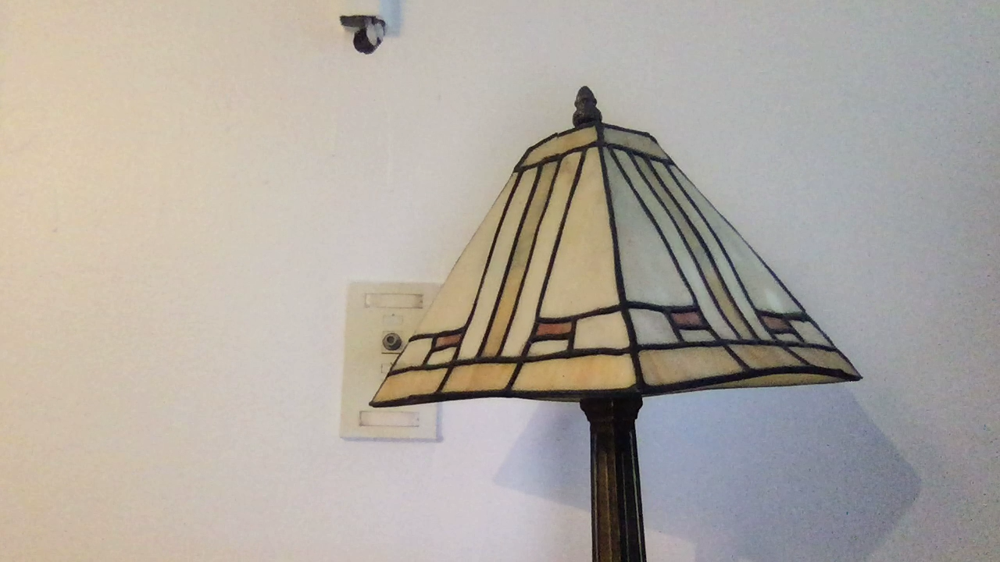
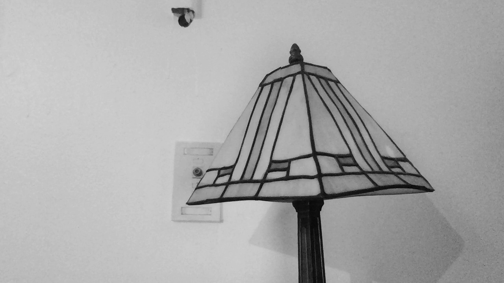
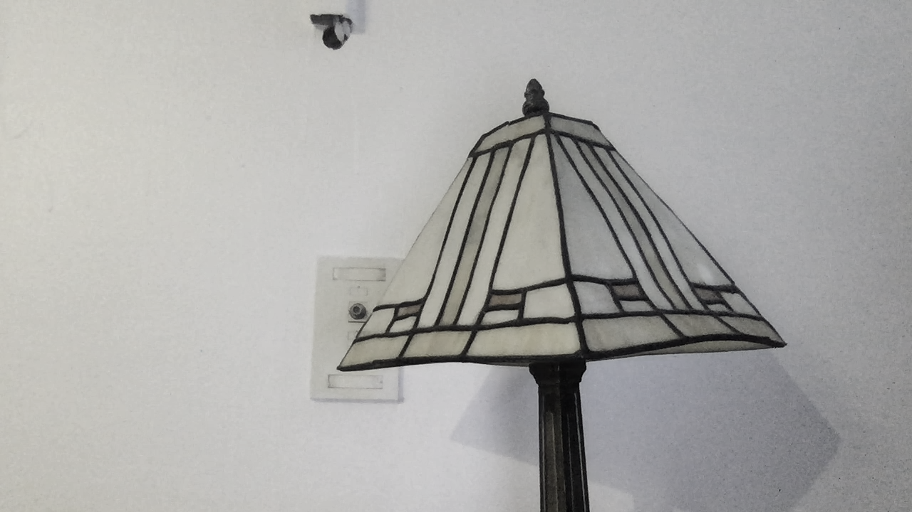
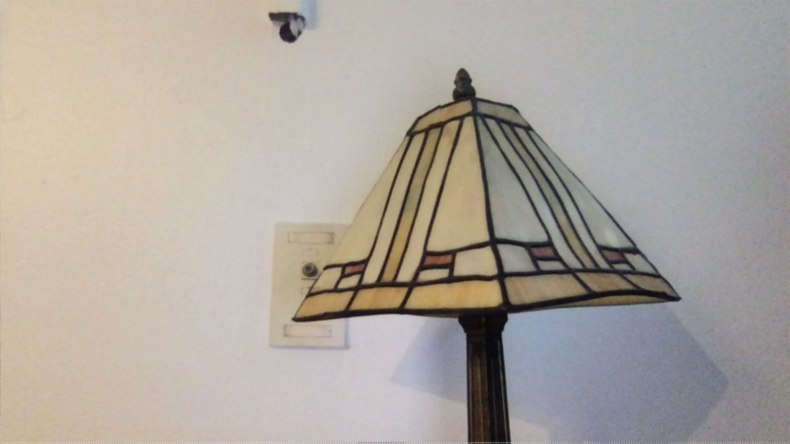
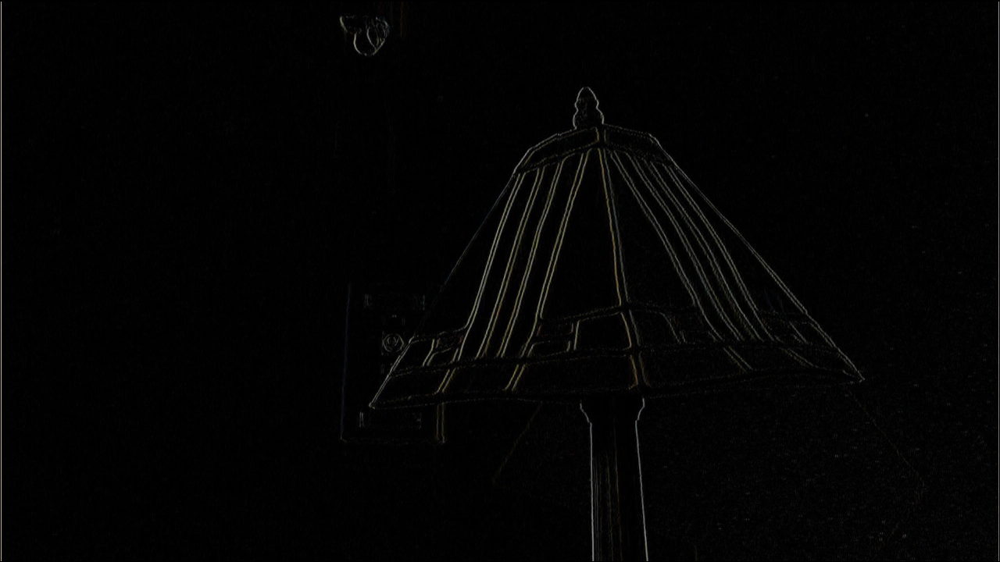
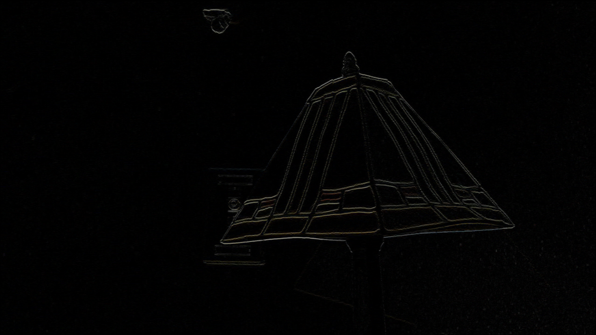
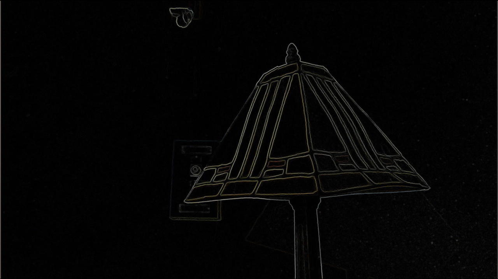
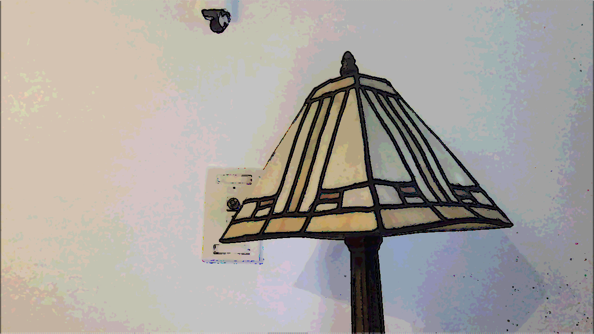
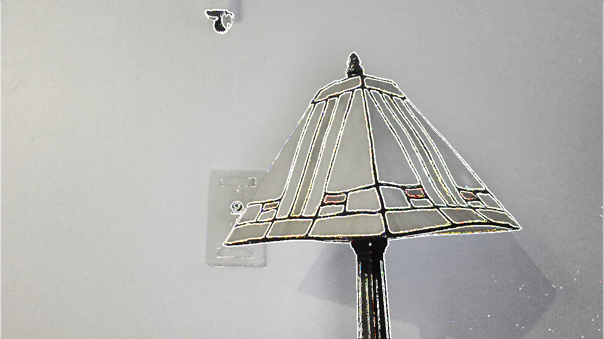

# Project 1: Real-time image filtering system

## Project Description

This project is a C/C++ and OpenCV implementation of various real-time image filtering functions. The program consists of the following files: "vidDisplay.cpp," "filter.cpp," "filter.h," as well as a "CMakeLists.txt" file that aids in code compilation using CMake. The "vidDisplay.cpp" file implements the main function, which opens a live video channel, creates a window, and displays a new frame through a loop. If the user types 'q,' the program will exit out of the loop that keeps the video capture open and the entire program will terminate. Additional keypress conditionals are implemented within the video capture loop, and they include 's' for saving images as .png files, and other keypresses for calling each filter function in the "filter.cpp" executable file. Aside from the first greyscale filter implementation that used the built-in OpenCV cvtColor() function, the rest of the filter functions manipulated individual pixels stored in the cv::Mat matrix format. In doing so, the filter functions had to assign the proper size and data types to each cv::Mat object that would then specify the correct color channel depth and the number of color channels. Each pixel is manipulated via various operations, such as convolution via separable x and y kernels, calculating the Euclidian distance for magnitude, and color quantization. 

## Instructions for running executables 

1. Place all files from the "vid_display" directory (filter.cpp, filter.h, vidDisplay.cpp) into a directory (i.e. assume it's called "proj1") <br />
2. You may download the CMake compiler then add your own CMakeLists.txt file to your directory for compiling OR you may opt to use a different compiling method.
3. **If using Visual Studio Code skip to step 6.** Otherwise, create a directory within your "proj1" directory called "build."<br />
4. If using CMake, while inside the "build" directory enter "cmake .." in the command line followed by "make." <br />
5. You should now be able to run the code by entering "./proj1" in the command line. <br />
6. Alternative to steps 3-5 if using Visual Studio Code: Compile and create "build" folder by using the "CMake Tools" extension, cd into the build folder, then enter "./proj1" to run the program. <br />
7. Refer to keypress definitions below 

### Keypress Definitions:
```
q = quit
s = save image as .png
spacebar = non-filtered image
g = cvtColor() grayscale
h = average grayscale
b = gaussian blur
x = sobel x
y = sobel y
m = gradient magnitude
l = blur and quantize
i = invert
c = cartoonized
```

## Filtered Image Sample Outputs

### Original Image


### cvtColor() Greyscale


Description: Original image (left) and cvtColor) greyscale image (right). The OpenCV built-in cvtColor() function was used to apply a greyscale filter to the image. The color space conversion code used was cv::COLOR_BGR2GRAY. 

### Average Greyscale


Description: Original image (left) and alternative greyscale image (right). The average color was computed by obtaining the sum of all red, green, and blue color channel pixels then dividing by 3. 

### Gaussian Blur


Description: Original image (left) and gaussian blur image (right). A 5x5 gaussian blur filter was implemented with two 1x5 separable vertical and horizontal kernels [ 1 2 4 2 1 ]. Separable filters can be used for symmetric filters in order to reduce the number of multiples and adds with convolution. The horizontal separable filter was first applied to each pixel in the image via convolution, then the vertical separable filter was applied via convolution to the output from the first filter. 

### Sobel X


Description: Original image (left) and sobel x image (right). The sobel x filter is a symmetric filter that detects vertical edges by applying two 1x3 separable filters, a positive filter [ 1 2 1 ] horizontally and a negative filter [ -1 0 1 ] vertically. The convolution from these kernels detects edges by finding large changes in intensity or color in the x direction. Anywhere there is an edge, the calculated pixel value will be positive. The output is a signed short CV_16SC3 image. 

### Sobel Y


Description: Original image (left) and sobel y image (right). The sobel y filter is a symmetric filter that detects horizontal edges by applying two 1x3 separable filters, a negative filter [ -1 0 1 ] horizontally and a positive filter [ 1 2 1 ] vertically. The convolution from these kernels detects edges by finding large changes in intensity or color in the y direction. Anywhere there is an edge, the calculated pixel value will be positive. The output is a signed short CV_16SC3 image. 

### Gradient Magnitude


Description: Original image (left) and gradient magnitude image (right). The gradient magnitude filter takes in the CV_16SC3 outputs from the sobel x and sobel y functions as parameters and generates the gradient magnitude by using Euclidean distance for magnitude: I = sqrt( sx*sx + sy*sy ). By combining the sobel x and sobel y outputs, we are now able to obtain an output that detects all edges from the x and y directions. 

### Blur and Quantize


Description: Original image (left) and blur and quantized image (right). The blur and quantize filter first calls the previously defined blur function and blurs the image. It then quantizes the image into a fixed number of levels, which is taken in as a parameter. When each color channel is quantized into a certain number of levels, it reduces the number of colors required to display the image. In other words, we reduce the 255 possible color clusters or shades of red, green, or blue by dividing 255 by the number of levels. We then take a color channel value, x, and calculate xt = x / (255/levels), then xf = xt * (255/levels). After computing this for each pixel and each color channel, the image should have levels**3 possible color values.

### Cartoonized


Cartoon video clip: https://drive.google.com/file/d/1VH6HbUszX0352z7_PlvPN_wfrOIJg-UF/view?usp=sharing

Description: Original image (left) and cartoon filter image (right). The cartoon filter first blurs and quantizes the image by calling the previously defined blur and quantize filter function. It then calls the gradient magnitude image in order to detect all of the edges in the image and set each edge pixel black (value = 0) where the magnitude is greater than a magnitude threshold (taken in as a parameter). This makes it so that there appears to be a black or pencil-sketch-like outline around each object in the image. In combination with the blur and quantize filter, which reduces the required color clusters in the image to create a painterly effect, the output is a cartoon-like image.

### Custom Greyscale with White Outline Filter


Description: Original image (left) and custom filter (right). This filter attempts to create a variation of the cartoon filter output. It first uses the previously defined greyscale filter function to make the image greyscale. It then uses the gradient magnitude filter function to turn pixels white (value = 255) where the magnitude is greater than a magnitude threshold. The resulting output is a greyscale image that creates white outlines where there are edges. 

### Khoury Wiki
https://wiki.khoury.northeastern.edu/display/~eilccn/CS5330+Project+1+Wiki 

