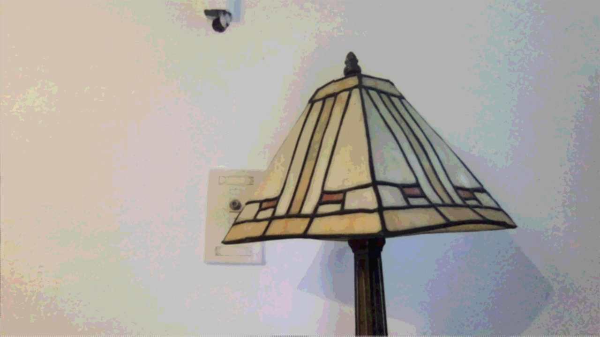

# Project 1: Real-time image filtering system

## Project Description

This project is a C/C++ and OpenCV implementation of various real-time image filtering functions. The program consists of the following files: "vidDisplay.cpp," "filter.cpp," "filter.h," as well as a "CMakeLists.txt" file that aids in code compilation using CMake. The "vidDisplay.cpp" file implements the main function, which opens a live video channel, creates a window, and displays a new frame through a loop. If the user types 'q,' the program will exit out of the loop that keeps the video capture open and the entire program will terminate. Additional keypress conditionals are implemented within the video capture loop, and they include 's' for saving images as .png files, and other keypresses for calling each filter function in the "filter.cpp" executable file. Aside from the first greyscale filter implementation that used the built-in OpenCV cvtColor() function, the rest of the filter functions manipulated individual pixels stored in the cv::Mat matrix format. In doing so, the filter functions had to assign the proper size and data types to each cv::Mat object that would then specify the correct color channel depth and the number of color channels. Each pixel is manipulated via various operations, such as convolution via separable x and y kernels, calculating the Euclidian distance for magnitude, and color quantization. 

## Instructions for running executables in the command line

1. Place all files from the "vid_display" directory (filter.cpp, filter.h, vidDisplay.cpp) into a directory (i.e. assume it's called "proj1") <br />
2. You may download the CMake compiler then add your own CMakeLists.txt file to your directory for compiling OR you may opt to use a different compiling method.
3. If using Visual Studio Code skip to step 6. Otherwise, create a directory within your "proj1" directory called "build."<br />
4. If using CMake, while inside the "build" directory enter "cmake .." in the command line followed by "make." <br />
5. You should now be able to run the code by entering "./proj1" in the command line. <br />
6. Alternative to steps 3-5 if using Visual Studio Code: Compile using the CMake extension, cd into the build folder, then enter "./proj1" to run the program. <br />
7. Refer to keypress definitions below 

## Keypress Definitions:
```
q = quit
s = save image as .png
spacebar = non-filtered image
g = cvtColor() grayscale
h = average grayscale
b = gaussian blur
x = sobel x
y = sobel y
m = gradient magnitude
l = blur and quantize
i = invert
c = cartoonized
```

## Filtered Image Sample Outputs

### Original Image


### cvtColor() Greyscale


### Average Greyscale


### Gaussian Blur


### Sobel X


### Sobel Y


### Gradient Magnitude


### Blur and Quantize


### Cartoonized


Cartoon video clip: https://drive.google.com/file/d/1VH6HbUszX0352z7_PlvPN_wfrOIJg-UF/view?usp=sharing

### Custom


## Khoury Wiki
https://wiki.khoury.northeastern.edu/display/~eilccn/CS5330+Project+1+Wiki 

